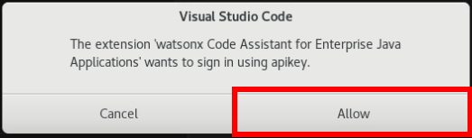
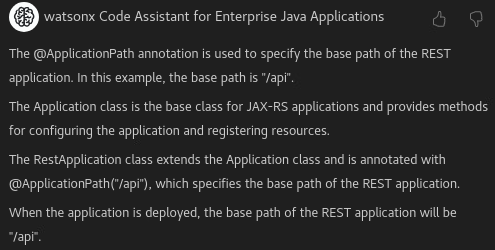
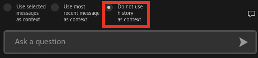

<PageDescription>

You might have some concerns with Cloud deployments such as serviceability, configuration, development, testing, and more. Luckily, MicroProfile addresses these concerns. MicroProfile defines cloud native API standards for developing portable microservices which function natively in the Cloud. IBM WebSphere Liberty offers a first-class implementation for MicroProfile. MicroProfile application development is even easier with Generative Artificial Intelligence (GenAI). This hands-on session shows how to use GenAI to help with MicroProfile application creation on Liberty. After this session, you should be able to use MicroProfile in your application with great confidence and significantly improved productivity.

</PageDescription>

# Notices and disclaimers

© 2024 International Business Machines Corporation. No part of this document may be reproduced or transmitted in any form without written permission from IBM.

U.S. Government Users Restricted Rights — use, duplication or disclosure restricted by GSA ADP Schedule Contract with IBM.

This document is current as of the initial date of publication and may be changed by IBM at any time. Not all offerings are available in every country in which IBM operates.

Information in these presentations (including information relating to products that have not yet been announced by IBM) has been reviewed for accuracy as of the date of initial publication and could include unintentional technical or typographical errors. IBM shall have no responsibility to update this information. 

This document is distributed “as is” without any warranty, either express or implied. In no event, shall IBM be liable for any damage arising from the use of this information, including but not limited to, loss of data, business interruption, loss of profit or loss of opportunity. IBM products and services are warranted per the terms and conditions of the agreements under which they are provided. The performance data and client examples cited are presented for illustrative purposes only. Actual performance results may vary depending on specific configurations and operating conditions.

IBM products are manufactured from new parts or new and used parts. In some cases, a product may not be new and may have been previously installed. Regardless, our warranty terms apply.”

Any statements regarding IBM's future direction, intent or product plans are subject to change or withdrawal without notice.

Performance data contained herein was generally obtained in a controlled, isolated environments. Customer examples are presented as illustrations of how those customers have used IBM products and the results they may have achieved. Actual performance, cost, savings or other results in other operating environments may vary. 

References in this document to IBM products, programs, or services does not imply that IBM intends to make such products, programs or services available in all countries in which IBM operates or does business. 

Workshops, sessions and associated materials may have been prepared by independent session speakers, and do not necessarily reflect the views of IBM. All materials and discussions are provided for informational purposes only, and are neither intended to, nor shall constitute legal or other guidance or advice to any individual participant or their specific situation.

It is the customer’s responsibility to ensure its own compliance with legal requirements and to obtain advice of competent legal counsel as to the identification and interpretation of any relevant laws and regulatory requirements that may affect the customer’s business and any actions the customer may need to take to comply with such laws. IBM does not provide legal advice or represent or warrant that its services or products will ensure that the customer follows any law.

Questions on the capabilities of non-IBM products should be addressed to the suppliers of those products. IBM does not warrant the quality of any third-party products, or the ability of any such third-party products to interoperate with IBM’s products. IBM expressly disclaims all warranties, expressed or implied, including but not limited to, the implied warranties of merchantability and fitness for a purpose.

The provision of the information contained herein is not intended to, and does not, grant any right or license under any IBM patents, copyrights, trademarks or other intellectual property right.

IBM, the IBM logo, and ibm.com are trademarks of International Business Machines Corporation, registered in many jurisdictions worldwide. Other product and service names might be trademarks of IBM or other companies. A current list of IBM trademarks is available on the Web at “Copyright and trademark information” at
<https://www.ibm.com/legal/copyright-trademark>.

# Background

## IBM WebSphere Liberty

[IBM WebSphere Liberty](https://www.ibm.com/websphere/liberty) is a next-generation Java application runtime that accelerates the delivery of cloud-native applications. WebSphere Liberty is largely based on the open-source [Open Liberty](https://github.com/OpenLiberty/open-liberty) project so some links and examples may point to Open Liberty documentation.

## Microservices

One of the transformative architectures that the cloud has accelerated is a [microservices architecture](https://www.ibm.com/topics/microservices). The idea is that once it's easier to build virtualized and isolated components, this allows breaking up traditional "monolith" applications into smaller and more nimble applications that talk to each other for faster development iteration and independent scaling capabilities. New Java application development standards have been developed to support the microservices architectural style and one such open source standard supported by IBM is [MicroProfile](https://microprofile.io/). Liberty is one application server that implements the MicroProfile standard.

## IBM watsonx Code Assistant

[IBM watsonx Code Assistant](https://www.ibm.com/products/watsonx-code-assistant) is a Large Language Model (LLM)-based generative AI based on IBM's Granite foundation models. [IBM watsonx Code Assistant for Enterprise Java Applications](https://www.ibm.com/products/watsonx-code-assistant-for-enterprise-java-applications) (WCA4EJA) is tuned specifically for Enterprise Java code. WCA4EJA is the main tool we will be using in this lab and it has capabilities to [generate code, explain code, generate tests, and more](https://www.ibm.com/blog/announcement/watsonx-code-assistant-java/).

### WCA4EJA Preview

At the time of this writing, a preview version of WCA4EJA is available for download for Visual Studio Code and Eclipse using the following link. The VS Code extension is already downloaded and installed in the lab image so this is only for reference if you'd like to explore more or try this out after the lab: <https://early-access.ibm.com/software/support/trial/cst/programwebsite.wss?siteId=2044&tabId=5712&p=&h=null>

The AI model used is the IBM Granite 20B enterprise Java code instruct model. This model was trained in two phases. In the first phase, the model was trained on 3 to 4 trillion tokens sourced from 116 programming languages, ensuring a comprehensive understanding of programming languages and syntax. In the second phase, the model was additionally trained on 500 billion tokens with a carefully designed mixture of high-quality data from code and natural language domains to improve the model's ability to reason. For more information about the IBM Granite 20B enterprise Java code instruct model, see [Granite Code Models: A Family of Open Foundation Models for Code Intelligence](https://arxiv.org/pdf/2405.04324).

Training of the IBM Granite 20B enterprise Java code instruct model included datasets for Jakarta EE, MicroProfile, and other enterprise Java repositories such as Open Liberty GitHub repositories.

The context window for the IBM Granite 20B enterprise Java code instruct model is 8192 tokens.

The model uses prompts for inference only and does not store any client prompts. None of your data is used to train the model in realtime or stored and used offline.

#### IBM Cloud Transformation Advisor

You may be familiar with the [IBM Cloud Transformation Advisor](https://www.ibm.com/products/cloud-pak-for-applications/transformation-advisor) tool which helps evaluate the transformation and modernization of code from older versions of Java and traditional programming models such as WebSphere Application Server traditional to platforms such as Liberty.

WCA4EJA includes the capabilities of Transformation Advisor and uses automation and generative AI to enact its recommendations.

#### Limitations

At the time of this writing, WCA4EJA has some limitations:

1. Only the Eclipse IDE is available to modernize your applications.
1. Only single module Maven WAR applications are supported. Although multi-module projects are not supported, you can point to a WAR module in a multi-module project.
1. Only Maven can be used to build applications.
1. The following use cases are supported only on macOS and Windows:
    1. Generating tests for your Java application with the Visual Studio Code extension
    1. Generating JUnit tests for your Java application with the Eclipse IDE
    1. Explaining code changes
    1. Explaining methods

For the above and other reasons, this lab does not explore all of the features of WCA4EJA; however, if you have the opportunity, we recommend that you check out Lab 1596: Hands-on workshop on AI in Java application development. Lab 1596 explores all of the features of WC4EJA.

#### Feedback

You can provide feedback on your experiences to the lab proctor, including suggestions for when your results don't match your expectations.

# Running the Lab

## Lab

This lab will go through the process of running IBM Watson Code Assistant for Enterprise Java Applications with a focus on MicroProfile applications. Additional "learn more" boxes may be peppered throughput the lab:

<InlineNotification>

These "learn more" boxes will be peppered throughout the lab steps to explain steps in more detail. We encourage you to read these or at least skim them to get a detailed understanding how everything works.

</InlineNotification>

Let's get started!

### Access the Virtual Machine

1.  The first screen you'll see is the lab page. Click on the `Console` button to access the lab machine:
    
    

1.  Click on the `Open in a new window` button to the left of the close button to open a larger screen:
    
    

1.  The screen is initially locked. Use your mouse to drag from the bottom to the top:
    
    

1.  Click on the **admin** user:
    
    

1.  Enter the password **IBMDem0s** (with a **zero** rather than an O) to login:
    
    

### Copy and Pasting

You may copy and paste from this lab guide into the client virtual machine:

1.  Ensure the target of the paste has focus in the virtual machine (e.g. a terminal window).

2.  Click the Cursor icon at the top of the client virtual machine browser tab:
    
    

3.  Paste something into the textbox and then click `Slow Send Text`. After the text has completed sending, click the close button in the top right of the send text popup.
    
    

4.  You can try `Fast Send Text` but be careful to double check if all characters were sent successfully.

### Open Visual Studio Code

We will use a pre-installed watsonx extension in Visual Studio Code which is a common code editor.

1.  Click on Activities in the top left:
    
    

2.  Click on the Visual Studio Code (vscode) icon to launch it:
    
    

3.  The watsonx Code Assistant for Enterprise Java Applications vscode extension has been pre-installed. Either click the wastonx icon on the left-hand side or click on the "Sign in with API Key" button if it is still visible (this goes to the same place as the icon on the left side):

    

4.  Click "Sign in with API Key":
    
    

5.  Under normal usage, at this point you will follow instructions to create an API Key. For the purposes of this lab, you will be provided an API key. Ask a lab proctor in the room for an API key. This lab is not supported outside a proctor-led lab.

6.  Click "Allow" to start the process:
    
    

7.  An input box shows up at the top of vscode. Enter the API key that you've been given and press Enter:
    
    

8.  After a few moments, the watsonx extension should show an updated welcome screen:
    
    

### Explain a Java class

First, let's get our feet wet by asking WCA4EJA to explain a Java class file. The lab image contains an MicroProfile starter project which we will open and explore:

1. Click on the file explorer in the top left of VS Code and then expand the `app-name` project and open `src/main/java/com/demo/rest/RestApplication.java`:
    
   

1. WCA4EJA adds Explain, Document, and Unit Test buttons above Java classes and methods:
    
   

1. Click the Explain button above the `RestApplication` class. The WCA4EJA extension window will open on the left side and send a request to the watsonx service to explain the selected code:
    
   

1. Next, click on the Document button above the `RestApplication` class. The WCA4EJA extension window will open on the left side and send a request to the watsonx service to generation code documentation for the selected class. If you are happy with the generated documentation code, you would then copy and paste the code into the file editor on the right.
    
   

### MicroProfile and GenAI

Now let's get to the heart of the lab and use GenAI to generate MicroProfile code. Let's start with a simple MicroProfile REST endpoint which will generate a weather forecast for a latitude/longitude point. REST is an architectural style for web service calls and it's implemented in MicroProfile using [Jakarta Enterprise Edition RESTful Web Service](https://en.wikipedia.org/wiki/Jakarta_RESTful_Web_Services).

First, we will explore how to use WCA4EJA. WCA4EJA has the concept of chats. The idea of a chat is that it's something like a memory of the GenAI which gives context to the next prompt. By default, the option "Use most recent message as context" is selected which means that the last result will be used as as part of the new prompt:

Since we are starting a new task of generating a new class, you can either start a new chat using the plus button at the top or switch the option to "Do not use history as context":

The idea is that chats are logical groupings of GenAI activities and they can be used to build upon past results. At the top, next to the option to start a new chat, you can also list all existing chats in case you want to switch contexts:

Now that you have either started a new chat, or selected not to use the past history, copy and paste a prompt such as the following and click the execute button:

> Create a MicroProfile class that receives requests at the path weather. The class should have a method named forecast which receives HTTP GET requests and produces a JSON response. The forecast method should take a double latitude and a double longitude as input.

After some time, WCA4EJA will respond with example code and a short explanation. We are already seeing the value of watsonx and WCA4EJA as this basic boilerplate code saves us a lot of time in remembering how to construct REST endpoints, accept parameters, and so on:

<InlineNotification>

As you may have noticed by the `import` statements, parts of MicroProfile such as REST support are implemented by Jakarta Enterprise Edition (`import jakarta...`) or Java Enterprise Edition (`import javax...`), so MicroProfile stands on top of some of the leading Java enterprise standards.

</InlineNotification>

You can now try different things and interact with watsonx. For example, we didn't provide much context about our application, so the generated code is in the `com.example.weather` package; however, our application is in the `com.demo.rest` package. Now you can switch the option back to "Use most recent message as context" and then execute the following prompt:

> Change the package to com.demo.rest

watsonx will generate the same code as before but the package is now correct:

Switch to the file explorer, and right click on the `rest` folder and click `New File...` and enter `WeatherService.java`:

Select all of the generated code from WCA4EJA (there is a copy-to-clipboard button at the top right of the code output) and paste into `WeatherService.java` in the file editor.

In the VS Code editor for `WeatherService.java`, select all of the code using your mouse or Ctrl^A. Whatever is selected will be used as context to the WCA4EJA prompt.

Now let's generate the implementation of the web service which calls the [Weather.gov API](https://www.weather.gov/documentation/services-web-api) using the latitude and longitude using the following prompt:

> Create a String named url that starts with "https://api.weather.gov/points/" and appends the latitude followed by the string "," and followed by the longitude. Then create a Jakarta REST ClientBuilder passing the URL to the target method and execute the get method. Read the resulting Response as a String entity and parse it using Json.createReader.

This results in the following output which is a good starting point for calling the Weather.gov API:

Switch back to the WCA4EJA view and copy and paste the various answers into `WeatherService.java` and you should end up with something like the following:

Additional code would be needed for a full implementation but watsonx has saved us a lot of time in creating the basic scaffolding of what we need.

Clicking the Document button on the `forecast` method quickly generates simple documentation which can be copy/pasted into the editor:

If you'd like to learn more about MicroProfile RESTful web services in general, we recommend the following Liberty guide: <https://openliberty.io/guides/rest-intro.html>

### Generate MicroProfile Configuration code

[MicroProfile Configuration](https://download.eclipse.org/microprofile/microprofile-config-3.0/microprofile-config-spec-3.0.html) (mpConfig) is a flexible way to configure an application using Java system properties, environment variables, properties files, and custom sources. Let's enhance our `WeatherService.java` to add some MicroProfile configuration elements to make the application more flexible.

Open `WeatherService.java` in the VS Code editor and select all of the code using your mouse or Ctrl^A. Whatever is selected will be used as context to the WCA4EJA prompt.

Start a new chat in WCA4EJA using the plus button at the top. For the prompt, enter something like the following:

> Add an MicroProfile Configuration field named baseURL wich a default String value of "https://api.weather.gov/points/" and then use this field in the forecast method.

Example result:

Notice that WCA4EJA was able to modify the class and augment it with the requested prompt. An additional `import` statement was added, the MicroProfile configuration field was added, and the `forecast` method was modified to use the new field.

Select all of the generated code (there is a copy-to-clipboard button at the top right of the code output) and replace `WeatherService.java` in the file editor.

If you'd like to learn more about MicroProfile Configuration in general, we recommend the following Liberty guide: <https://openliberty.io/guides/microprofile-config-intro.html>

### Generate MicroProfile metrics code

[MicroProfile Metrics](https://download.eclipse.org/microprofile/microprofile-metrics-5.0.0/microprofile-metrics-spec-5.0.0.html) (mpMetrics) provides a standardized way to publish metrics to determine health in detail and generate capacity planning data. Let's enhance our `WeatherService.java` to add some MicroProfile metrics elements to make the application easier to monitor.

Open `WeatherService.java` in the VS Code editor and select all of the code using your mouse or Ctrl^A. Whatever is selected will be used as context to the WCA4EJA prompt.

Start a new chat in WCA4EJA using the plus button at the top. For the prompt, enter something like the following:

> Add MicroProfile Metrics Timed and Counted annotations to the forecast method with a name of forecastTime.

Example result:

Notice that WCA4EJA was able to modify the class and augment it with the requested prompt. Additional `import` statements were added, `@Timed` and `@Counted` annotations were added to the method, and it was smart enough to give different names to the different annotations.

Select all of the generated code (there is a copy-to-clipboard button at the top right of the code output) and replace `WeatherService.java` in the file editor.

If you'd like to learn more about MicroProfile Metrics in general, we recommend the following Liberty guide: <https://openliberty.io/guides/microprofile-metrics.html>

### Generate a health check

[MicroProfile Health](https://download.eclipse.org/microprofile/microprofile-health-4.0.1/microprofile-health-spec-4.0.1.html) (mpHealth) provides standardized `/health` HTTP endpoints that determine whether an application is ready to serve user traffic either through basic built-in heuristics (e.g. the application has started) or through custom application code. This endpoint is particularly useful in Kubernetes environments to help its routing infrastructure know when to send traffic to a pod and/or kill a pod; however, it is also useful in non-Kubernetes environments.

Start a new chat in WCA4EJA using the plus button at the top. For the prompt, enter something like the following:

> Generate a Java class which is an MicroProfile health check which creates a Jakarta REST ClientBuilder passing the URL of "https://api.weather.gov/" to the target method and executing the get method. If the String result of the call includes "OK" then return UP for the health check. Otherwise, return DOWN.

The resulting health check can use some clean up but it saves a lot of time and gets things mostly correct. In this example, the `if` check is wrong as it's checking for `"UP"` instead of `"OK"` as requested in the prompt. This shows the importance of carefully reviewing code generated by GenAI systems and this applies to all such systems.

If you'd like to learn more about MicroProfile Health in general, we recommend the following Liberty guide: <https://openliberty.io/guides/microprofile-health.html>

### Generate MicroProfile fault tolerance code

[MicroProfile Fault Tolerance](https://download.eclipse.org/microprofile/microprofile-fault-tolerance-4.1/microprofile-fault-tolerance-spec-4.1.html) (mpMetrics) provides a standardized way to help applications fail fast and recover smoothly by guiding how and when certain requests occur and by providing fallback strategies to handle common errors.

Open `WeatherService.java` in the VS Code editor and select all of the code using your mouse or Ctrl^A. Whatever is selected will be used as context to the WCA4EJA prompt.

Start a new chat in WCA4EJA using the plus button at the top. For the prompt, enter something like the following:

> Add the MicroProfile Fault Tolerance Timeout annotation to the forecast method with a value of 300 milliseconds.

Example result:

Notice that WCA4EJA was able to modify the class and augment it with the requested prompt. An additional `import` statement was added and an `@Timeout` annotation was added to the method.

Select all of the generated code (there is a copy-to-clipboard button at the top right of the code output) and replace `WeatherService.java` in the file editor.

#### Fault tolerance circuit breaker

Open `WeatherService.java` in the VS Code editor and select all of the code using your mouse or Ctrl^A. Whatever is selected will be used as context to the WCA4EJA prompt.

Start a new chat in WCA4EJA using the plus button at the top. For the prompt, enter something like the following:

For the prompt, enter something like the following:

> Add the MicroProfile Fault circuit breaker with a success threshold of 10, request volume threshold of 4, failure ratio of 0.75, and delay of 1000 to the forecast method.

Example result:

Select all of the generated code (there is a copy-to-clipboard button at the top right of the code output) and replace `WeatherService.java` in the file editor.

#### Fault tolerance circuit bulkhead

Open `WeatherService.java` in the VS Code editor and select all of the code using your mouse or Ctrl^A. Whatever is selected will be used as context to the WCA4EJA prompt.

Start a new chat in WCA4EJA using the plus button at the top. For the prompt, enter something like the following:

For the prompt, enter something like the following:

> Add a MicroProfile Fault Tolerance bulkhead with a maximum of 5 concurrent requests to the forecast method.

Example result:

Select all of the generated code (there is a copy-to-clipboard button at the top right of the code output) and replace `WeatherService.java` in the file editor.

If you'd like to learn more about MicroProfile Fault Tolerance in general, we recommend the following Liberty guide: <https://openliberty.io/guides/retry-timeout.html>

### Conclusion

This completes the lab. We hope this demonstrated how to use GenAI to accelerate MicroProfile code generation. As IBM's foundational models improve, everything from implementation, testing, documentation, and more will continue to improve. We encourage you to continue to explore using the preview version of watsonx Code Assistant for Enterprise Java Applications on your own time (free IBMid required to login and access): <https://early-access.ibm.com/software/support/trial/cst/programwebsite.wss?siteId=2044&tabId=5712&p=&h=null>. Work with your IBM Account Team on the best way to access watsonx through IBM Cloud.

# Getting help and troubleshooting

This section provides information about getting help with your lab and some common troubleshooting topics.

## Common troubleshooting tips

### Error: Generated code not shown due to unmet requirements

You may see the following response from watsonx:

> Generated code not shown due to unmet requirements. Please try again.

In some cases, repeating the same prompt will work and in other cases you may need to modify the prompt a little bit to avoid this error.

Work is underway to improve this error and its prevalence for the generally available release of WCA4EJA.

### Error: IBM watsonx Code Assistant for Enterprise Java Applications doesn't support generated code in this programming language.

This can be ignored and will be fixed after the preview version.

## Getting help

For additional details about WCA4EJA and help resources, review the private preview link (free IBMid required to login and access): <https://early-access.ibm.com/software/support/trial/cst/programwebsite.wss?siteId=2044&tabId=5712&p=&h=null>
